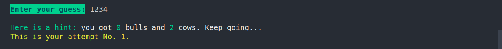
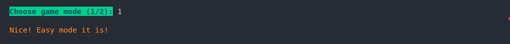
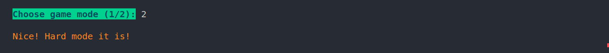

# Bulls and Cows Game


A simple console-based implementation of the Bulls and Cows guessing game in Node.js. Test your code-breaking skills and have fun while playing!

## Table of Contents

- [Getting Started](#getting-started)
- [Game Rules](#game-rules)
- [How to Play](#how-to-play)
- [Game Modes](#game-modes)
- [Gameplay](#gameplay)
- [Build with](#build-with)
- [Features](#features)
- [Authors](#authors)
- [License](#license)

## Getting Started

### Prerequisites

Before you start, make sure you have **Node.js** installed on your machine.

### Installation

1. Clone the repository or download the source code:

```bash
git clone https://github.com/yourusername/bulls-and-cows-game.git
```

2. Navigate to the project directory:

```bash
cd bulls-and-cows-game
```

3. Install the required npm packages:

```bash
npm install
```

## Game Rules

Bulls and Cows is a guessing game where the player tries to guess a secret 4-digit number with unique digits. The game provides feedback in the form of "bulls" and "cows" after each guess.

- A "bull" indicates that a digit in the guessed number is in the correct position.
- A "cow" indicates that a digit in the guessed number is correct but in the wrong position.
- The goal is to guess the secret number with the fewest attempts possible.

  

## How to Play

1. Navigate to the output directory

```bash
cd output
```

2. Start the game using the following command:

```bash
node index.js
```

3. You will be prompted to enter your name, or you can leave it as "Stranger."

4. Choose the game mode (easy or hard) by entering "1" or "2" based on your preference.

5. In easy mode, there is no limit to the number of attempts. In hard mode, you have a maximum of 10 attempts to guess the secret number.

6. Enter a 4-digit number as your guess. The game will provide feedback on the number of bulls and cows in your guess.

7. Keep guessing until you correctly guess the secret number or run out of attempts.

8. You can choose to play another round or exit the game.

## Game Modes

- **Easy Mode**: Unlimited attempts to guess the secret number.

  

- **Hard Mode**: Limited to 10 attempts to guess the secret number.

  

## Gameplay

The game will provide feedback on each guess, letting you know how many bulls and cows are in your guess.
If you correctly guess the secret number, you win the game and receive a congratulatory message.
If you run out of attempts without guessing the secret number, you lose and are provided with the secret number.

## Build with

- Javascript
- Typescript
- npm
- Node.js
- Chalk
- Prompt
- Center-text

## Features

1. **Top-Secret Code Generator:**
   - Unleash the unpredictability of our secret code generator for a fresh challenge in every game.
2. **Two Mission Levels:**
   - Easily pick your mission difficulty using our game mode selector, crafted to cater to both beginners and experts alike.
3. **Smart Input Validation:**
   - Stay sharp with our validator, offering clear error messages and guiding you through each move.
4. **Move Tracker:**
   - Keep count of your every move with the attempts tracker.
5. **Hint Messages:**
   - Stuck? Get a helping hand with the hint feature, providing clues to steer you in the right direction with every guess.
6. **Progress Tracker:**
   - Monitor your gaming journey with the total games played tracker, showcasing your commitment to mastering the secret code.
7. **Winning Rate Analytics:**
   - Measure your code-breaking performance with the winning rate calculator, revealing the percentage of games conquered.
8. **Seamless Replay:**
   - Dive into a new challenge instantly with the "Play Again" feature, ensuring uninterrupted gaming fun.
9. **User-Friendly Interface:**
   - Immerse yourself in the game with a command-line interface designed for a smooth and enjoyable experience.
10. **Addictive Challenge:**
    - Enjoy a captivating gameplay experience that blends entertainment with code-cracking mastery. Get ready for the ultimate coding adventure!

## Authors

- Marinna Pereira
- Vasylyna Sidei

## License

This project is licensed under the [MIT License](https://opensource.org/license/mit/).
